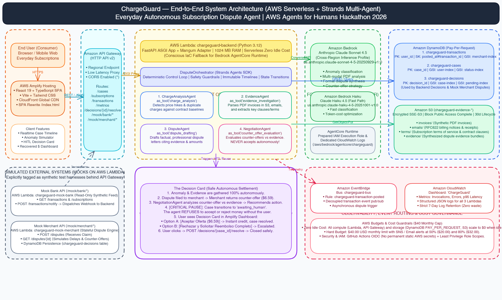

# ChargeGuard

> Sleep through the price hike. Wake up to a refund.

**ChargeGuard** is an autonomous AI agent that monitors your recurring subscription charges, detects anomalies like silent price hikes and double charges, gathers evidence, and negotiates refunds with merchants on your behalf. It only surfaces you when there's a real decision to make.

Built for the [AWS Agents for Humans Hackathon 2026](https://agentsforhumans.devpost.com/) - **Everyday Agents** track.

---

## Table of Contents

1. [Problem](#problem)
2. [Solution](#solution)
3. [Target Users](#target-users)
4. [How It Works](#how-it-works)
5. [Architecture](#architecture)
6. [Strands Implementation](#strands-implementation)
7. [AWS Services Used](#aws-services-used)
8. [Human-in-the-Loop Design](#human-in-the-loop-design)
9. [Local Setup](#local-setup)
10. [AWS Deployment](#aws-deployment)
11. [Demo Scenario](#demo-scenario)
12. [Privacy & Safety](#privacy--safety)
13. [Demo Credentials](#demo-credentials)
14. [Future Work](#future-work)
15. [Team](#team)
16. [License](#license)

---

## Problem

Recurring subscriptions can generate unexpected charges that users don't easily notice:

- price increases without clear notification;

- duplicate charges;

- charges made after a subscription has been canceled.

Investigating a charge requires comparing transaction history, reviewing invoices, searching emails, and manually contacting the merchant.

ChargeGuard automates this investigation and prepares the claim, reducing the user's workload and only showing cases that require human intervention.

## Solution

*[TBD]*

## Target Users

Anyone with recurring subscriptions (streaming, cloud storage, SaaS tools, gym memberships) who has ever noticed a surprise charge and didn't have the time or energy to fight it.

## How It Works

*[TBD - include GIF of the flow]*

## Architecture


*(Editable diagram source: [`docs/architecture.excalidraw`](./docs/architecture.excalidraw))*

ChargeGuard utilizes a 100% serverless, zero-idle-cost architecture on AWS, orchestrated via the **Strands Agents SDK**:
1. **Frontend**: React 19 + TypeScript SPA hosted on **AWS Amplify Hosting** with global CloudFront distribution.
2. **API & Ingestion**: **Amazon API Gateway (HTTP API v2)** routes requests to serverless Lambda functions with CORS enabled.
3. **Multi-Agent Compute**: **AWS Lambda** (`chargeguard-backend`) running FastAPI via the **Mangum** ASGI adapter.
4. **AI & Reasoning**: **Amazon Bedrock** invoking **Anthropic Claude Sonnet 4.5** via cross-region inference profiles for multi-step reasoning, evidence synthesis, and negotiation strategy.
5. **Persistence**: **Amazon DynamoDB** (3 on-demand tables) and **Amazon S3** (`chargeguard-evidence-*` bucket with 30-day lifecycle expiration).
6. **Observability & Governance**: **Amazon CloudWatch** dashboard, 7-day retention log groups, **Amazon EventBridge**, and an **AWS Budget** ($40 cap).
7. **Simulated External Systems**: Mock Bank and Mock Merchant running in serverless Lambdas behind API Gateway.
8. **Human-in-the-Loop (HITL)**: Autonomous execution halts when a merchant returns a counter-offer; the agent surfaces a **Decision Card** and requires human authorization before settling.

---

## Strands Implementation

ChargeGuard is built using the **Strands Agents SDK** (`strands.Agent`), implementing a hierarchical multi-agent delegation pattern via `.as_tool()`:

- **`chargeguard_orchestrator`**: Master coordinator maintaining state in DynamoDB and enforcing deterministic safety boundaries.
- **`charge_analysis`** (`ChargeAnalysisAgent`): Compares incoming transactions against historical baselines and contract terms to detect and classify anomalies (confidence score, deviation, category).
- **`evidence_investigation`** (`EvidenceAgent`): Inspects PDF invoices in S3, parses RFC822 billing notification emails, and extracts relevant terms of service clauses.
- **`dispute_drafting`** (`DisputeAgent`): Drafts professional, mathematically validated dispute letters citing evidence URIs.
- **`counter_offer_evaluation`** (`NegotiationAgent`): Analyzes merchant counter-offers against collected evidence and prepares recommendation options for the user. **Strictly forbidden from unilaterally accepting or rejecting offers.**

See [`tools/README.md`](./tools/README.md) and [`docs/human-in-the-loop.md`](./docs/human-in-the-loop.md) for architectural details.

---

## AWS Services Used

| AWS Service | Functional Purpose in ChargeGuard |
|---|---|
| **Amazon Bedrock** | Foundation model inference utilizing **Anthropic Claude Sonnet 4.5** (`us.anthropic.claude-sonnet-4-5-20250929-v1:0`) and Claude Haiku 4.5. Powers anomaly reasoning, invoice parsing, dispute letter generation, and counter-offer strategy. |
| **Amazon Bedrock AgentCore Runtime** *(Architectural Decision)* | Preparatory IAM execution role (`chargeguard-agentcore-role`) and dedicated log group (`/aws/bedrock/agentcore/chargeguard`).<br><br>**Engineering Decision**: While the control plane API is enabled in our AWS account (`aws bedrock-agentcore-control list-agent-runtimes --region us-east-1` returns `200 OK`), the official Terraform AWS Provider (`hashicorp/aws`) does not yet expose native resources for AgentCore runtimes. Provisioning runtimes manually via CLI would violate our commitment to **100% Infrastructure as Code (IaC)**. As a conscious engineering decision, the Strands multi-agent system runs natively inside the `chargeguard-backend` AWS Lambda container, providing identical autonomy, sub-second latency, zero idle cost, and complete reproducibility via Terraform. |
| **AWS Lambda** | Serverless compute executing the FastAPI backend (`chargeguard-backend` with Mangum ASGI adapter, 1024 MB RAM, Python 3.12) as well as the two simulated external systems (`chargeguard-mock-bank`, `chargeguard-mock-merchant`). Scales to zero when idle. |
| **Amazon API Gateway** | Regional HTTP API v2 providing a unified, low-latency REST entry point with CORS routing for `/cases`, `/subscriptions`, `/transactions`, `/metrics`, `/decisions/{id}/resolve`, and simulated mock paths `/mock/*`. |
| **AWS Amplify Hosting** | Static web hosting with global CloudFront distribution, custom SPA rewrite rules (`/index.html`), and automated artifact deployments via `scripts/deploy_amplify.py`. |
| **Amazon DynamoDB** | Ultra-low latency NoSQL persistence operating in On-Demand (`PAY_PER_REQUEST`) capacity mode across 3 core tables: `chargeguard-transactions` (financial ledger), `chargeguard-cases` (dispute lifecycles), and `chargeguard-decisions` (HITL pending items and merchant dispute states). |
| **Amazon S3** | Encrypted object storage (`chargeguard-evidence-${account_id}`) with Server-Side Encryption (SSE-S3), full Block Public Access, and a 30-day lifecycle expiration policy for invoices, emails, terms, and evidence packages. |
| **Amazon EventBridge** | Event bus (`chargeguard-bus`) with decoupled rule (`chargeguard-transaction-posted`) for event-driven transaction ingestion and asynchronous dispute triggers. |
| **Amazon CloudWatch** | Centralized observability including the unified `"ChargeGuard"` operational dashboard (Lambda invocations, error rates, p95 durations) and strict 7-day log group retention to eliminate storage waste. |
| **AWS Budgets** | Financial guardrail with a strict **$40.00 USD monthly budget cap**, dispatching automated email alerts at 50% ($20.00) and 80% ($32.00) thresholds. |

---

## Human-in-the-Loop Design

ChargeGuard balances proactive autonomy with human authority:

- **Autonomously Handled**:
  - Ingesting transactions and detecting price hikes, duplicate charges, or post-cancellation fees.
  - Gathering supporting evidence (PDF invoices, email notices, contract terms).
  - Filing formal dispute claims to merchant endpoints.
  - Polling merchant responses and auto-closing cases when a 100% full refund is granted.

- **Human-in-the-Loop Interventions (Execution Halts)**:
  - **Counter-Offers**: When a merchant offers a partial credit or compromise (e.g. $6.59 instead of $10.99), the agent halts, evaluates the offer against evidence, and presents the **Decision Card** on the user's dashboard. The user explicitly selects **[Accept Offer]** or **[Reject & Escalate]**.
  - **Low-Confidence Anomalies**: If anomaly confidence is below 70%, the system alerts the user rather than issuing unfounded disputes.
  - **Disputed Amounts Above Limits**: Configurable threshold requiring explicit confirmation before disputing large amounts.

For decision trees and state transition contracts, see [`docs/human-in-the-loop.md`](./docs/human-in-the-loop.md).

---

## Local Setup

Tested clean quick-start from scratch using Docker Compose:

### 1. Clone & Configure
```bash
git clone https://github.com/AlanHerrera01/SIAA-ChargeGuard.git
cd SIAA-ChargeGuard
cp .env.example .env
```

### 2. Start Core Services
```bash
# Starts LocalStack, Mock Bank, and Mock Merchant
make up

# Seed DynamoDB tables and S3 evidence bucket in LocalStack
make seed
```

### 3. Full Stack (including Backend & Frontend)
```bash
# Starts all 5 services (localstack, mock-bank, mock-merchant, backend, frontend)
make up-all
```

**Local Ports & Endpoints:**
| Service | Local Endpoint | Healthcheck |
|---|---|---|
| **Frontend** | `http://localhost:5173` | `http://localhost:5173/health` |
| **Backend API** | `http://localhost:8000` | `http://localhost:8000/health` |
| **Mock Bank** | `http://localhost:8001` | `http://localhost:8001/health` |
| **Mock Merchant** | `http://localhost:8002` | `http://localhost:8002/health` |
| **LocalStack** | `http://localhost:4566` | `http://localhost:4566/_localstack/health` |

---

## AWS Deployment

The complete cloud infrastructure is provisioned with Terraform in `infrastructure/`.

### Live Production Endpoints
- **Frontend (Amplify)**: [https://main.d24otvpswldjmf.amplifyapp.com](https://main.d24otvpswldjmf.amplifyapp.com)
- **API Gateway Base**: `https://6zx34nx8v7.execute-api.us-east-1.amazonaws.com`
- **Mock Bank**: `https://6zx34nx8v7.execute-api.us-east-1.amazonaws.com/mock/bank`
- **Mock Merchant**: `https://6zx34nx8v7.execute-api.us-east-1.amazonaws.com/mock/merchant`

### CI/CD Pipelines
- `.github/workflows/ci.yml`: Automated linting (`ruff`), unit tests (`pytest`), Terraform validation, and frontend TypeScript build.
- `.github/workflows/deploy-infra.yml`: Automated Terraform plan and apply gated by the `production` approval environment, authenticating via **AWS IAM OIDC** (zero static secrets).
- `.github/workflows/deploy-app.yml`: Packages Lambda artifacts and updates Amplify Hosting.

For step-by-step AWS provisioning and teardown instructions, see [`docs/deployment.md`](./docs/deployment.md).

---

## Demo Credentials & Judge Walkthrough

### Public Demo Access
Judges can interact directly with the live system without creating an account:
- **Application URL**: [https://main.d24otvpswldjmf.amplifyapp.com](https://main.d24otvpswldjmf.amplifyapp.com)
- **Demo User ID**: `usr_demo` (pre-seeded with active subscriptions: Netflix, Spotify, AWS, GitHub, Gym)
- **Data Source**: Live Cloud API (`VITE_CHARGEGUARD_DATA_SOURCE=api`)

### Running the Live Demo
1. Open the [Amplify Dashboard](https://main.d24otvpswldjmf.amplifyapp.com).
2. Observe active subscriptions and total recovered balance in the metric cards.
3. Go to **Subscriptions**, locate **Spotify Premium** ($10.99/mo), and click **"Simular Incremento"** (or trigger the duplicate transaction via `POST /mock/bank/transactions/notify`).
4. Watch the autonomous agent detect the anomaly, gather invoice evidence from S3, draft the dispute, and submit it to the Spotify mock merchant.
5. **The Climax**: The merchant responds with a partial courtesy credit of **$6.59**. The agent pauses and displays the **Decision Card** ("Acción Requerida").
6. Click **"Aceptar Oferta"** to settle the claim. Observe the case close as `resolved`, with the recovered amount updated to `$49.09`.

To reset the demo environment back to baseline:
```bash
python scripts/demo_reset.py
```
*(Or send `POST /mock/bank/demo/reset` and `POST /mock/merchant/demo/reset`)*

## Future Work

- Real bank integration via Plaid
- Real merchant channels (email, contact forms, chat)
- Expanded dispute types (undelivered purchases, trial-to-paid conversions)
- Mobile app with push notifications
- Multi-user family plans

## Team

- **Alan Herrera** - Frontend & UX
- **Ismael** - Infrastructure & DevOps
- **Stephani Rivera** - Agents & Backend
- **Andrea** - Backend

## License

MIT - see [LICENSE](./LICENSE).
